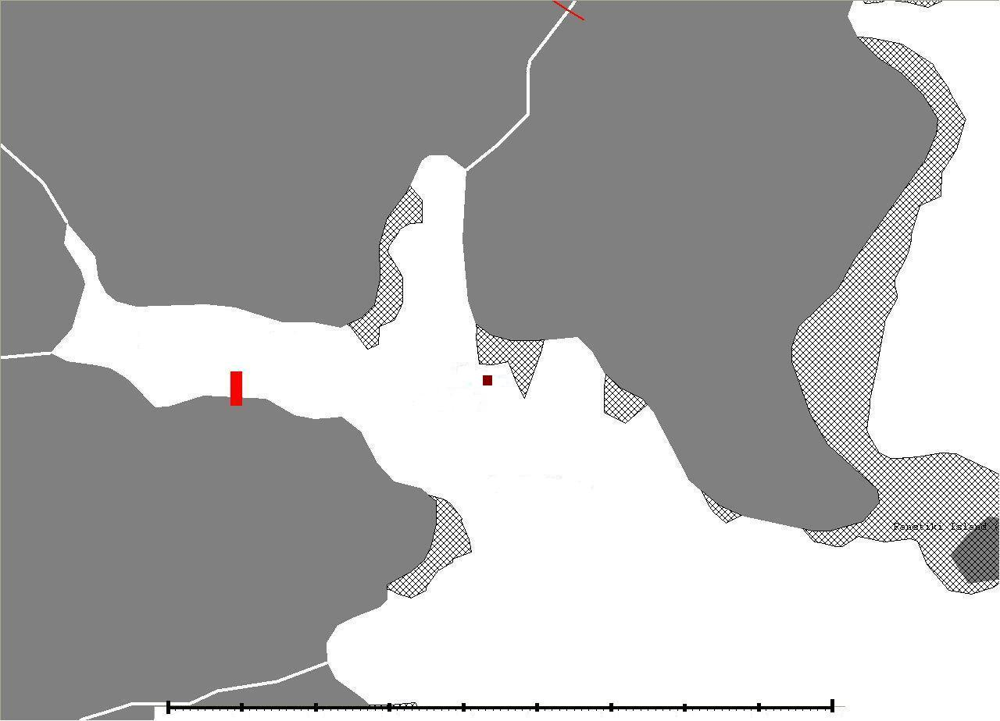

```{r}
#| include: false
# Pakete laden, die fuer Inline-R-Code in diesem Kapitel benoetigt werden
library(knitr)
library(kableExtra)
library(flextable)
```

# Material und Methodik

<!-- Ausfuehrliche Anleitungen zu allen hier gezeigten Quarto-Features
     findest du im Writing Guide:
     https://github.com/uham-bio/quarto-UHHthesis/blob/main/docs/writing-guide.md -->

Was genau in diesem Kapitel aufgefuehrt wird, haengt sehr von der Art der Abschlussarbeit ab, ob es sich um ein Laborexperiment, eine Feldstudie oder eine theoretische bzw. Modellierungsarbeit handelt. Bei Feldstudien ergeben sich typischerweise folgende Abschnitte:

- Untersuchungsgebiet
- Experimentelles Design
- Datenerhebung
- Statistische Analyse mit Angabe der entsprechenden Computerprogramme ^[wie [R](https://cran.r-project.org/) - so macht man uebrigens eine Fussnote]


## Untersuchungsgebiet

Externe Grafiken (z.B. Karten) werden mit Quartos Markdown-Bildersyntax eingebettet. Die Bildunterschrift wird in eckigen Klammern angegeben, die Breite ueber das Attribut `width`:

{#fig-location width="50%"}


## Querverweise

Abbildungen werden mit `@fig-label` referenziert, Tabellen mit `@tbl-label`. Labels duerfen **keine Unterstriche** enthalten --- verwende stattdessen Bindestriche. Kapitel lassen sich ueber `[Kapitelname]` verlinken, z.B. [Diskussion]. Eine vollstaendige Uebersicht findest du in der Projektdokumentation.


## Mathematische Gleichungen

Inline-Gleichungen nutzen einfache Dollarzeichen: $E = mc^2$. Abgesetzte Gleichungen nutzen doppelte Dollarzeichen: $$E = mc^2$$

Fuer nummerierte Gleichungen mit Querverweisen wird ein Label mit `{#eq-label}` nach den abschliessenden `$$` gesetzt (siehe @eq-mean):

$$
  \bar{X} = \frac{\sum_{i=1}^n X_i}{n}
$$ {#eq-mean}

Formeln sind immer in Saetze zu integrieren und enden mit Komma oder Punkt.


## Chemische Formeln

Mit `$\mathrm{...}$` wird die automatische Kursivierung im Mathematikmodus vermieden:

- Tiefgestellt: $\mathrm{CH_4}$
- Hochgestellt: $\mathrm{O^-}$
- Kombiniert: $\mathrm{Fe_2^{2+}Cr_2O_4}$ ueber `$\mathrm{Fe_2^{2+}Cr_2O_4}$`
- Hydrat: CuCl $\bullet$ $\mathrm{7H_{2}O}$
- Pfeile: $\longrightarrow$ (Reaktion), $\rightleftharpoons$ (Gleichgewicht), $\leftrightarrow$ (Resonanz)
- Delta: $\Delta$

Nummerierte Reaktionsgleichungen nutzen den Display-Modus mit Label:

$$
  \mathrm{C_6H_{12}O_6 + 6O_2} \longrightarrow \mathrm{6CO_2 + 6H_2O}
$$ {#eq-reaction}

Querverweis ueber @eq-reaction. Unnummerierte Reaktionen im Fliesstext nutzen Dollarzeichen: $\mathrm{NH_4Cl_{(s)}} \rightleftharpoons \mathrm{NH_{3(g)}+HCl_{(g)}}$


## Software

Dieser Abschnitt sollte standardmaessig immer zum Schluss kommen. Hier wird aufgelistet, welche R Version und welche Pakete mit Versionsnummer genutzt wurden. Es duerfen hier auch nicht die Referenzen fuer die jeweiligen Pakete fehlen. Der folgende Text erstellt alles Noetige automatisch. Hier muessen einfach nur die verwendeten Pakete aktualisiert werden:

Die Analysen wurden mit der Statistiksoftware R (Version `r paste(R.Version()$major, R.Version()$minor, sep = ".")`) [@R-base] durchgefuehrt. Die Abschlussarbeit selbst, einschliesslich der Tabellen, wurde mit Quarto (Version `r system("quarto --version", intern = TRUE)`), 'knitr' (Version `r packageVersion("knitr")`) [@R-knitr], 'kableExtra' (Version `r packageVersion("kableExtra")`) [@R-kableExtra], und 'flextable' (Version `r packageVersion("flextable")`) [@R-flextable] erstellt.
